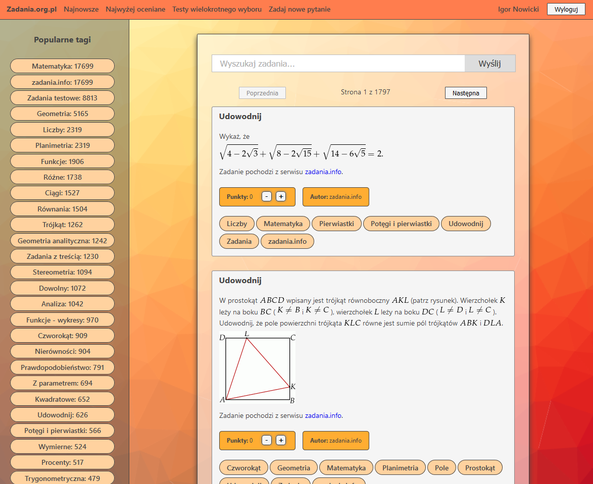

# Zadania.org.pl

## Krótki opis

Strona jest połączeniem StackExchange z generatorem zadań. Każde zadanie jest zamieszczone w postaci posta z którym jest stowarzyszony zestaw odpowiedzi zamieszczany przez użytkowników.

- generowanie sprawdzianów
- generowanie zestawów ćwiczeniowych
- generowanie testów wielokrotnego wyboru
- generowanie zautomatyzowanych zadań
